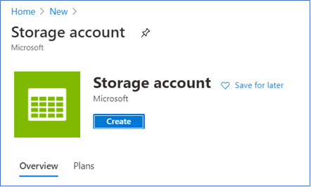
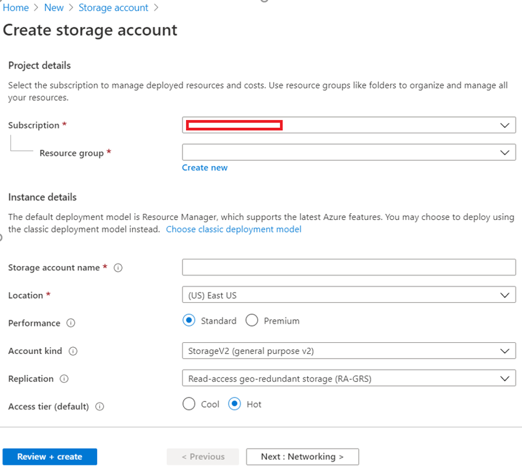
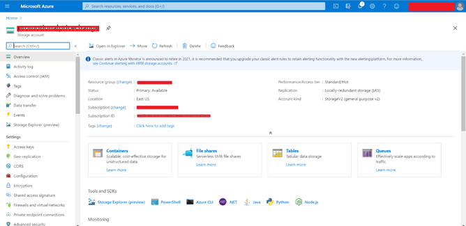
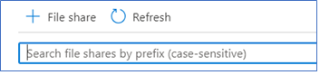
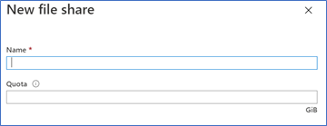
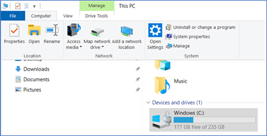
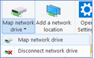
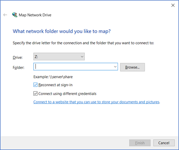

# Azure File Storage

## Step 1: Create Azure Storage

1. Login to Azure Portal
2. Create a new resource of Storage Account

3. Give the required details in the screen shown below
 

4. Review and Create the Storage account
5. The account will be created and you can see the below screen 

## Step 2: Create File Share and get required details

1. Click on File Shares
2. Create new File share by clicking the &quot;+ File Share&quot; button at the top

3. Give a proper name and size for the file share

4. Click open the file share. It will be empty at first
5. Go to Properties and Copy the URL
6. Now Go to Storage Account level and click on Access Keys
7. Copy the Storage Account Name and Key 1.Key

## Step 3: Set up local drive

1. Go to the Local Drive

2. Click in any available Drives  Go to Computer  Click in Map Network Drive

3. Select any available drive of your choice and give the URL we copied in the last step

  - The URL must be supplied as the one shown just below the Folder textbox.
  - If your URL looks like this https://\&lt;storageaccountname\&gt;.file.core.windows.net/\&lt;filesharename\&gt; this should be modified as

\\\&lt;storageaccountname\&gt;.file.core.windows.net\\&lt; filesharename\&gt;

5. Select &quot;Connect using different Credentials&quot;
6. Give the Storage account name we copied earlier as the user name
7. Give the Key1.key as password
8. Now the folder is setup

## Step 4: Add Files

You can add files in the Azure or in the local folder.