# Working with Azure Key Vault

## Azure Scope

All Azure activity should be wrapped up inside the Azure Scope. You can find the Azure Scope under Cloud Activities  Azure  Azure Scope

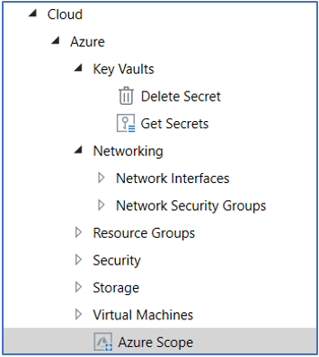

Below are the required parameters for defining the Azure Scope.

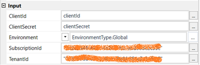

### Step 1: Getting Subscription Id

1. Login to the [https://portal.azure.com](https://portal.azure.com/)
2. In the Home page you can find the Subscriptions item 

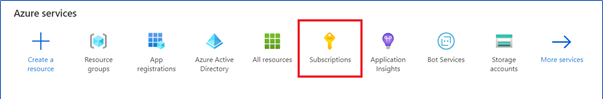

3. Click on Subscription
4. You can find the subscription id here 

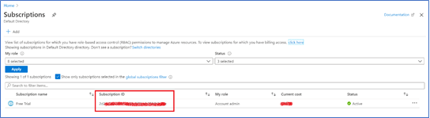

5. Update this information in the **SubscriptionId** Field

### Step 2: Getting the Tenant ID and Client ID

1. Go to App Registration in Azure Portal
2. Click on &quot;+ New Registration&quot; 

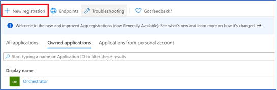

3. In the new registration page,
  - Give a name of your choice. Let us give, &quot;my-azure-apps&quot;
  - In Supported Types, Select &quot;Default Directory Only&quot; as of now.
  - In Redirect URL, Select Web [http://localhost](http://localhost/)
  - Click Register

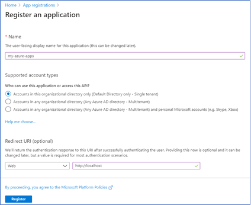

4. Open the resource and you can find the below information 

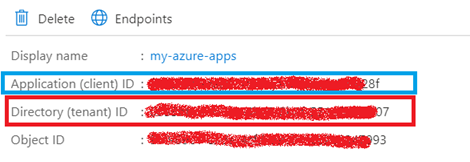

5. Provide the &quot;Directory (tenant) ID&quot; information in the TenantID Field in the Azure Scope
6. Provide the &quot;Application (client) ID&quot; information in the Client ID Filed in the Azure Scope

### Step 3: Creating Client Secret

1. In the app registration page, go to &quot;Certificates and Secrets&quot; (numbered 1) menu on your left

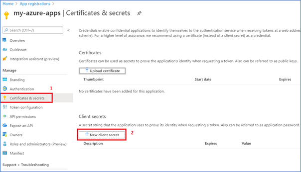

2. Create a new client secret by clicking the button numbered 2 in the above image.
3. Give a meaningful name and Click Add

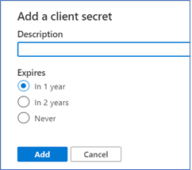

4. Store the client secret generated safely somewhere
5. Provide that information in the Client Secret Field

**Note:**

**The Client Secret is accepted only as a Secure String. If you are using an orchestrator Create an Asset of Credential Type and save both Client ID and Secret. You can get it using a Get Credential Activity in UiPath Studio. Or you can use Windows Credential Manager if not using Orchestrator.**

With this the Azure Scope Setup is complete.


## Working with Key Vault

Official Documentation : [https://docs.microsoft.com/en-us/azure/key-vault/](https://docs.microsoft.com/en-us/azure/key-vault/)

### Step 1: Creating a Key Vault Resource

1. Go to Home page in Azure Portal
2. Create a New Resource for Azure Key Vault 


3. Give a meaningful name and click Create 

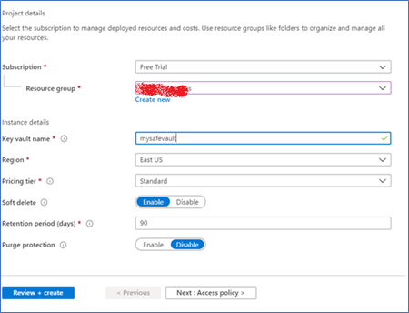

4. Once the resource is created you will get these information in the Overview page 

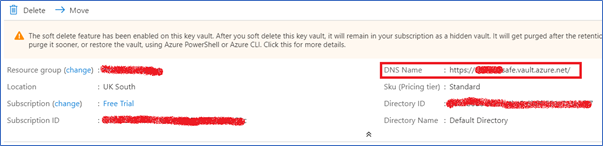

5. Store the DNS name, which may be useful for future use.

### Step 2: Connecting our Registered App and Key Vault

1. Go to Access Policies menu in the Key Vault

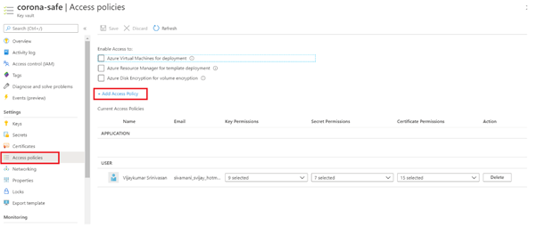

2. Click on &quot;+ Add Access Policy&quot;. Do not worry about the existing default Policy.
3. In Add Policy page, under Secret Permission, select the 4 items as shown below. 

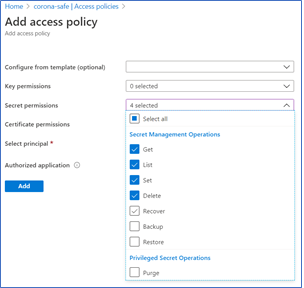

4. In the Select Principal Option, select the Registered App. In this case my-azure-apps, and click Select 

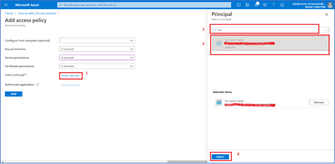

5. Now it will appear in the Application Access Policy 

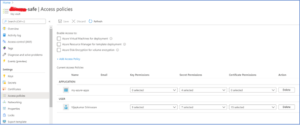

### Step 3: Adding Secrets to your vault

1. Go to Secrets menu on the left-hand side
2. Click on + Generate/Import
3. Give a meaningful secret name and a value
4. Click Create.

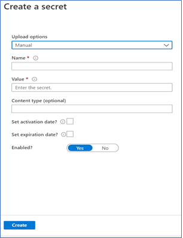

5. Now you have created a secret and added into your vault. You can create any many secrets you want in one vault.

### Step 4: UiPath Activity

Your UiPath activity should look like one shown below

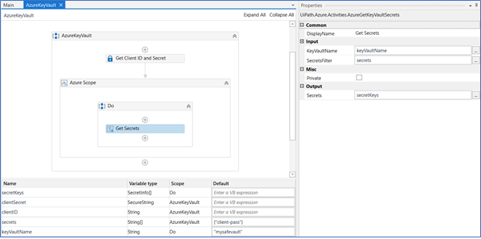

1. Get the Client ID and Secret stored in the Orchestrator
2. Create an Azure Scope with all the required parameters discussed in Azure Scope Section of this document
3. Inside the Do sequence, drag &quot;Get Secrets&quot; Activity.
  - Input parameters:
    ```sh
    - KeyVaultName: Give your Key vault name

    - SecretFilter: give all your required Secret Key Names to get the values. Accepts String[].
    ```
  - Output:
    > Output is received as &quot;UiPath.Azure.Models.SecretInfo[]&quot;. This will be an array of Secret Values in the Order your queried.
4. The SecretInfo has Name-Value pair. We can get
    ```sh
    - Name as SecretInfo(0).Name 

    - Secret as SecretInfo(0).Value
    ``` 

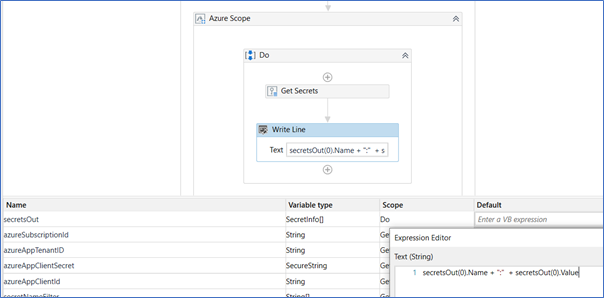

All done !